# 14.1 Создание и использование секретов

1) Задача 1: Работа с секретами через утилиту kubectl в установленном minikube


- Как создать секрет?

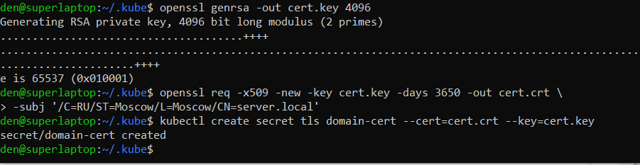

- Как просмотреть список секретов?

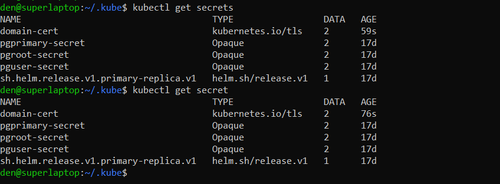

- Как просмотреть секрет?

 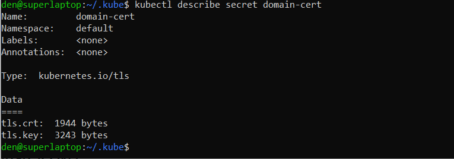

Как получить информацию в формате YAML и/или JSON?

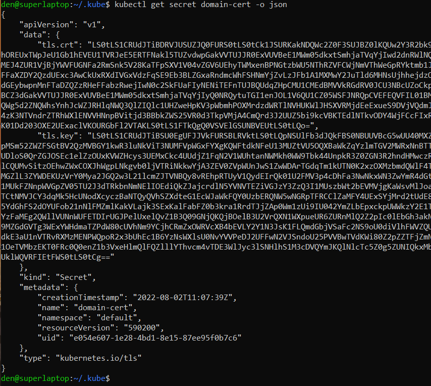

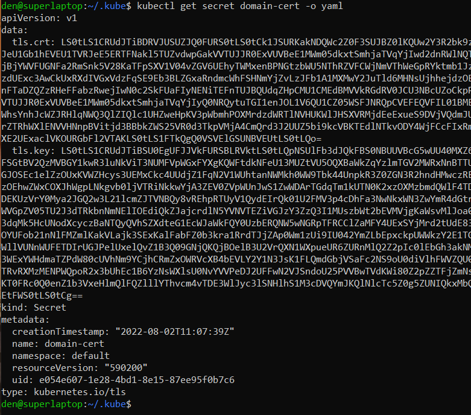

- Как выгрузить секрет и сохранить его в файл?

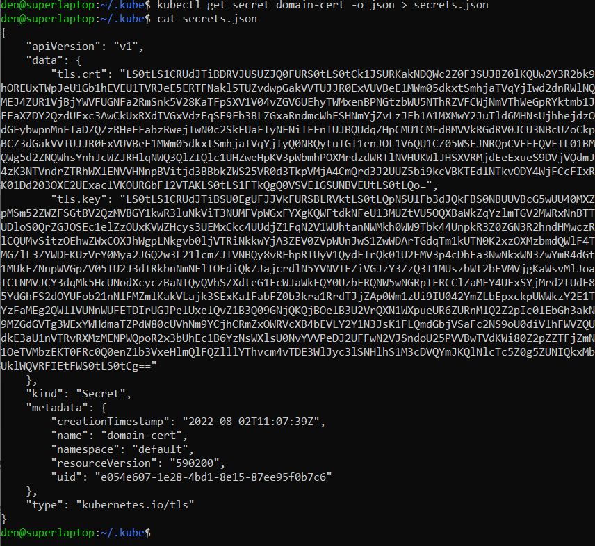

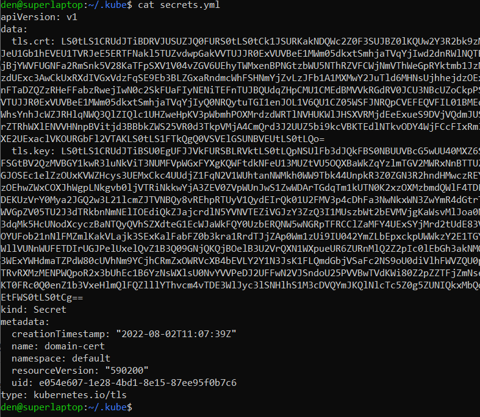

- Как удалить секрет?

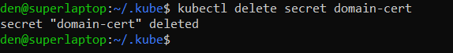

- Как загрузить секрет из файла?

 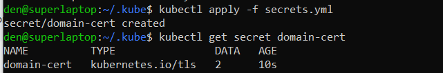

2) Задача 2 (*): Работа с секретами внутри модуля
Выберите любимый образ контейнера, подключите секреты 
и проверьте их доступность как в виде переменных окружения, так и в виде примонтированного тома.


- В виде переменных окружения

```
apiVersion: v1
kind: Pod
metadata:
  name: my-pod
spec:
  containers:
    - name: mycontainer
      image: nginx
      env:
        - name: cert.crt
          valueFrom:
            secretKeyRef:
              name: domain-cert
              key: tls.crt
        - name: cert.key
          valueFrom:
            secretKeyRef:
              name: domain-cert
              key: tls.key
  restartPolicy: Never
```

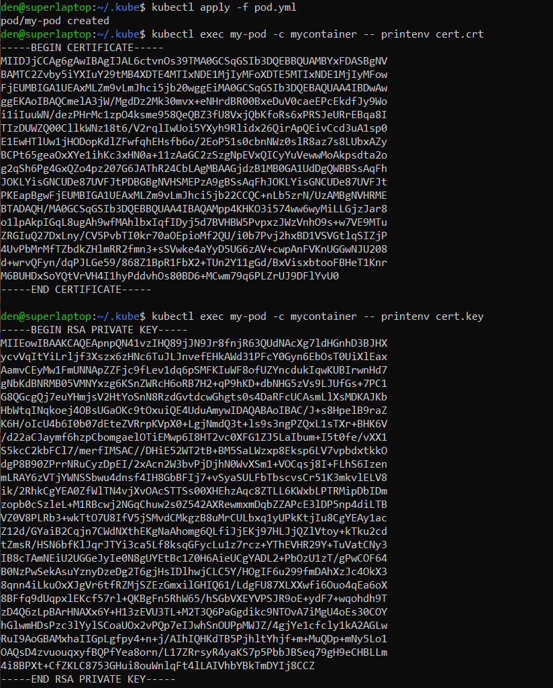

- В виде примонтированного тома
```
apiVersion: v1
kind: Pod
metadata:
  name: my-pod
spec:
  containers:
    - name: mycontainer
      image: nginx
      volumeMounts:
      - name: secrets
        mountPath: "/secrets"
        readOnly: true
  volumes:
  - name: secrets
    secret:
      secretName: domain-cert
      optional: false
  restartPolicy: Never
```

 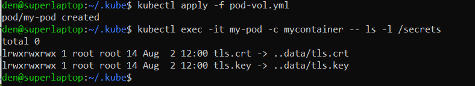