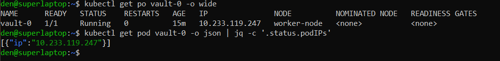
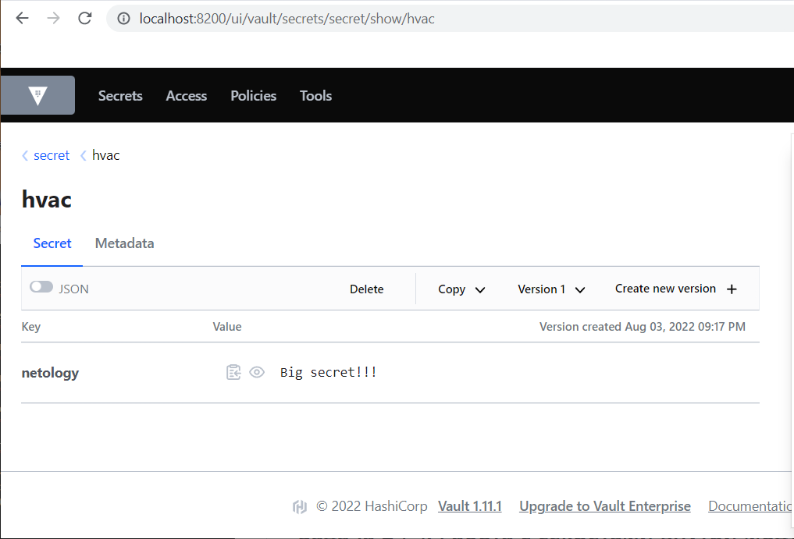
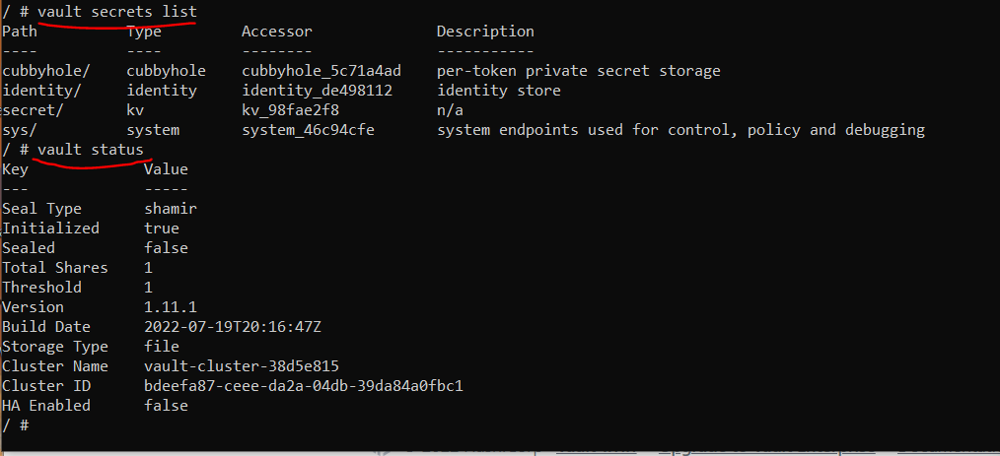
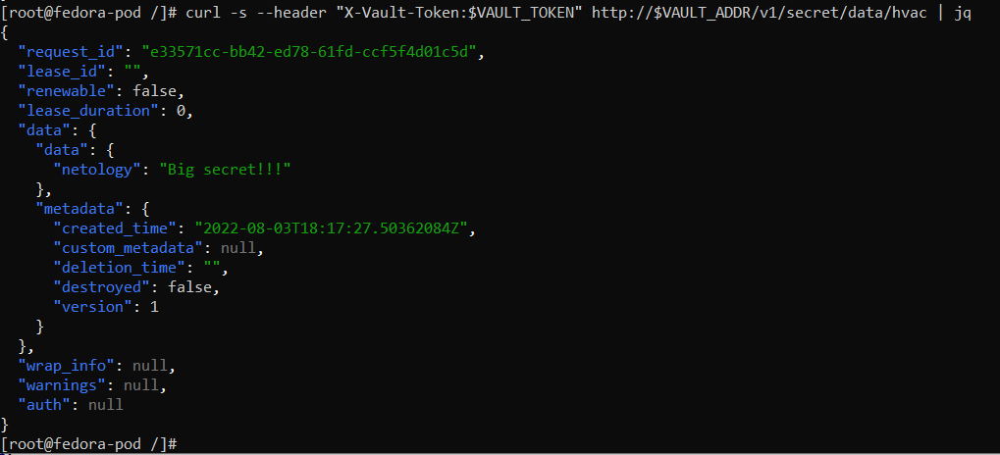

# 14.2 Синхронизация секретов с внешними сервисами. Vault

1) Задача 1: Работа с модулем Vault


- Запустить модуль Vault конфигураций через утилиту kubectl в установленном minikube
    <br/><br/>
    kubectl apply -f 14.2/vault-pod.yml  
    Получить значение внутреннего IP пода   
    <br/>
    kubectl get pod 14.2-netology-vault -o json | jq -c '.status.podIPs'  
    Примечание: jq - утилита для работы с JSON в командной строке





- Запустить второй модуль для использования в качестве клиента
    <br/><br/>
    kubectl run -i --tty fedora --image=fedora --restart=Never -- sh  
    Установить дополнительные пакеты  
    Запустить интепретатор Python и выполнить следующий код, предварительно поменяв IP и токен
```
import hvac
client = hvac.Client(
    url='http://10.10.133.71:8200',
    token='aiphohTaa0eeHei'
)
client.is_authenticated()

# Пишем секрет
client.secrets.kv.v2.create_or_update_secret(
    path='hvac',
    secret=dict(netology='Big secret!!!'),
)

# Читаем секрет
client.secrets.kv.v2.read_secret_version(
    path='hvac',
)
```

Ключ добавлен!


Vault работает!



2) Задача 2 (*): Работа с секретами внутри модуля

На основе образа fedora создать модуль;
Создать секрет, в котором будет указан токен;
Подключить секрет к модулю;
Запустить модуль и проверить доступность сервиса Vault.


Ниже манифест: модуль fedora + secret

```
---
apiVersion: v1
kind: Pod
metadata:
  name: fedora-pod
spec:
  containers:
  - name: fedora
    image: fedora
    command: ["/bin/sh"]
    args: ["-c", "while true; do echo hello; sleep 10;done", "&"]
    env:
    - name: VAULT_TOKEN
      valueFrom:
        secretKeyRef:
          name: myvault
          key: token
    - name: VAULT_ADDR
      value: vault:8200
---
apiVersion: v1
data:
  token: aHZzLjRNUjJFejdHd0RDalJyRDJIR2RydEFNYg==
kind: Secret
metadata:
  name: myvault
type: Opaque
```

 - Проверка доступности Vault

