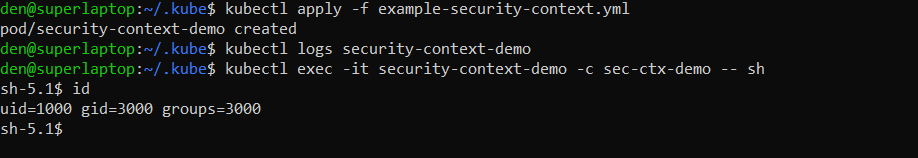
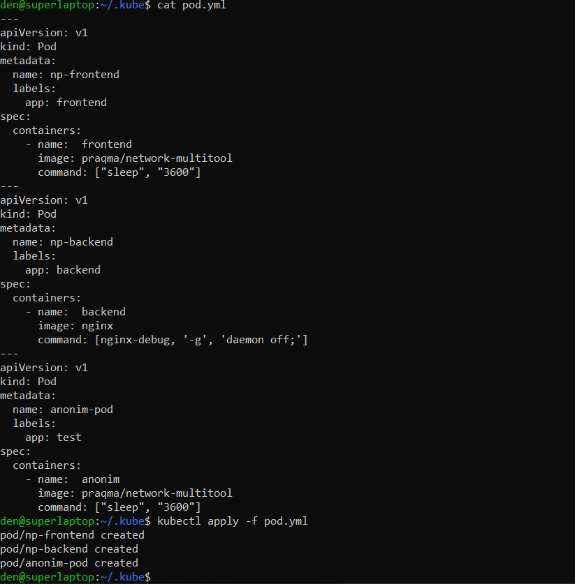
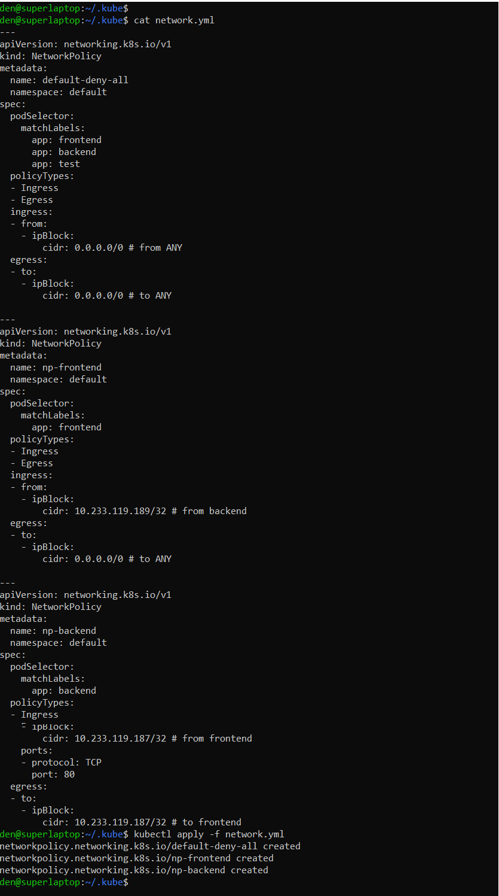
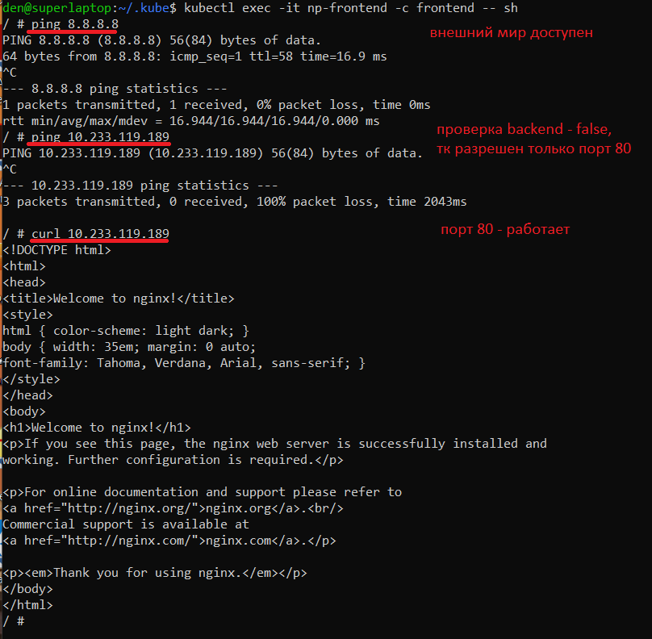
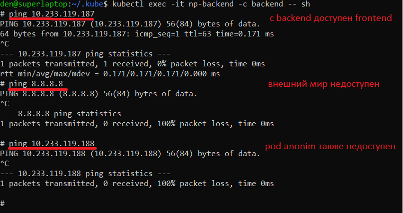
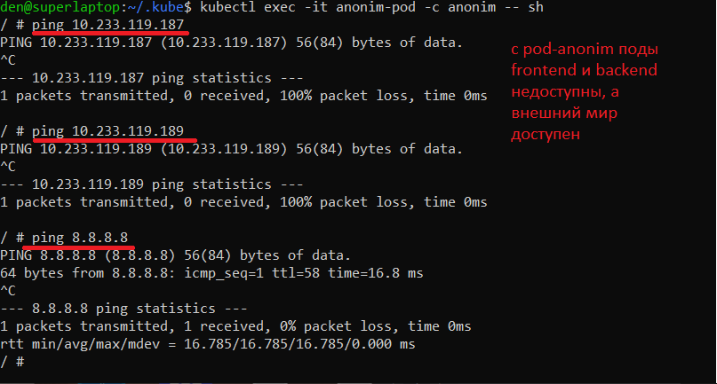

# 14.5 SecurityContext, NetworkPolicies

Задача 1: Рассмотрите пример 14.5/example-security-context.yml

Задача 2 (*): Работа с картами конфигураций внутри модуля

- pods manifest

- network policy manifest

## Tests
- From frontend

- From backend

- From anonim (произвольный POD без политик)

