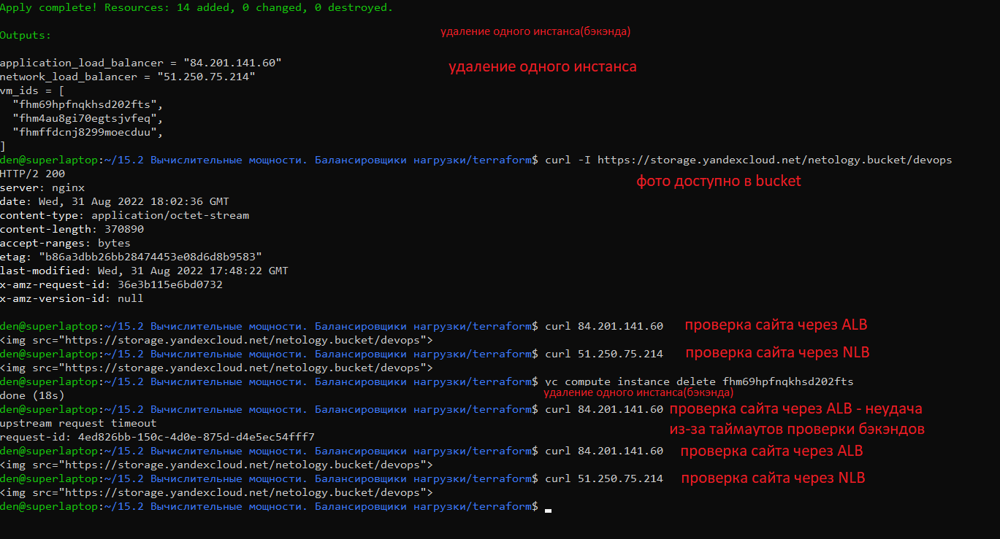

# 15.2 Вычислительные мощности. Балансировщики нагрузки

Задание 1. Яндекс.Облако (обязательное к выполнению)

- Каталог с файлами 
[terraform](terraform)

Развертывание решения в YandexCloud
``` 
cd terraform
terraform apply 
```

- Результат



