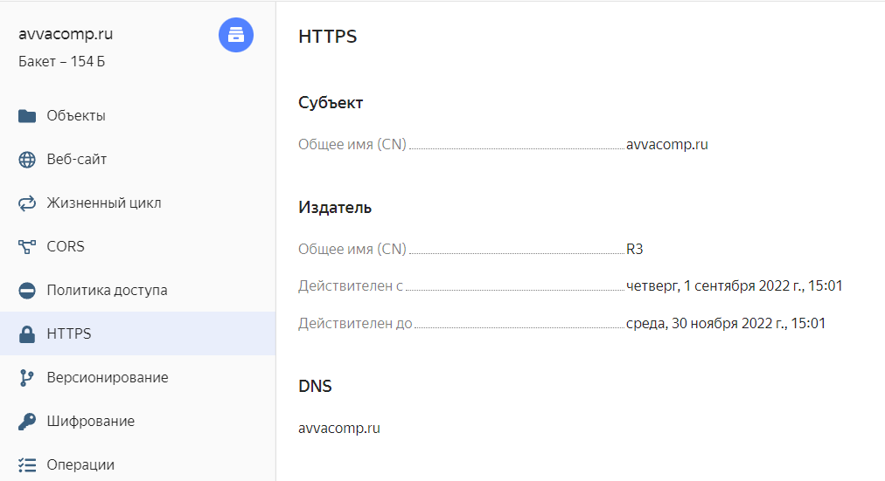
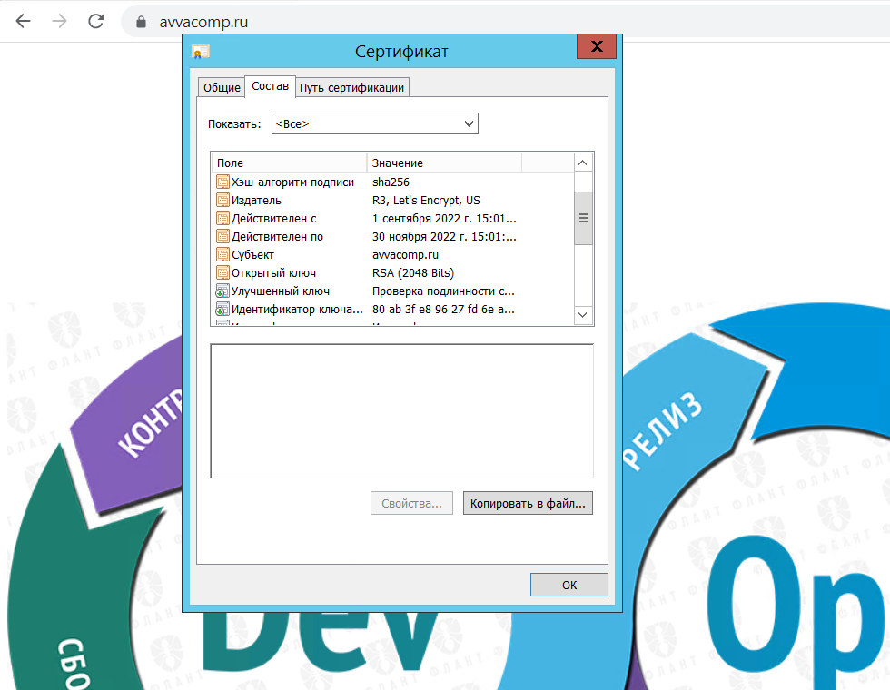
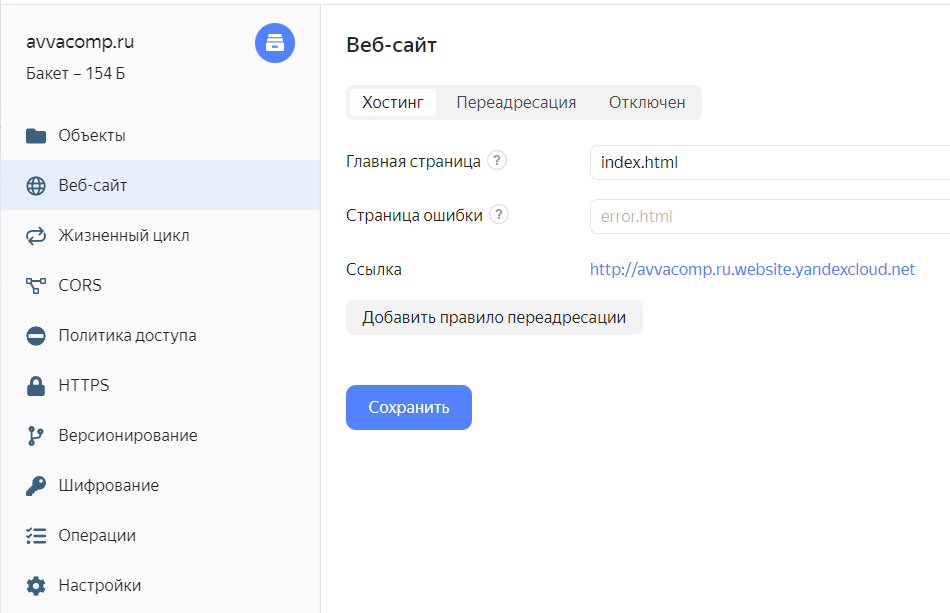

# 15.3 Безопасность в облачных провайдерах.md

Задание 1. Яндекс.Облако (обязательное к выполнению)

### п.1
- Каталог со всеми файлами 
[terraform](terraform)
- Файл терраформ с созданием зашифрованного бакета
[resources.tf](terraform/resources.tf)

Развертывание решения в YandexCloud
``` 
cd terraform
terraform apply 
```

### п.2
(Выполняется НЕ в terraform) *Создать статический сайт в Object Storage c 
собственным публичным адресом и сделать доступным по HTTPS
- Результат






