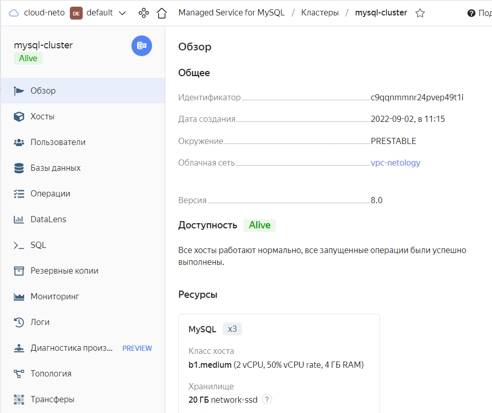
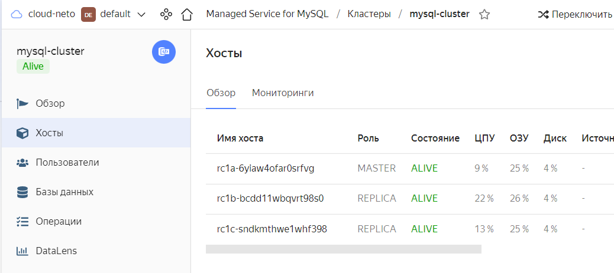
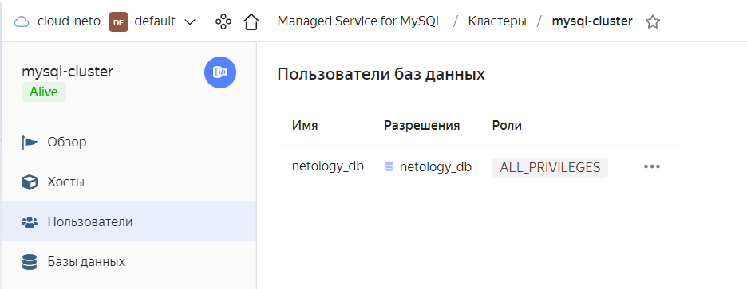
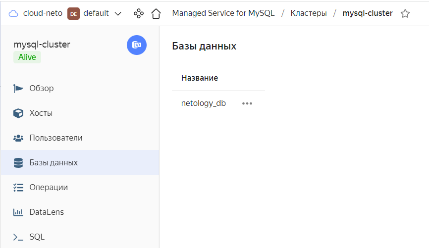
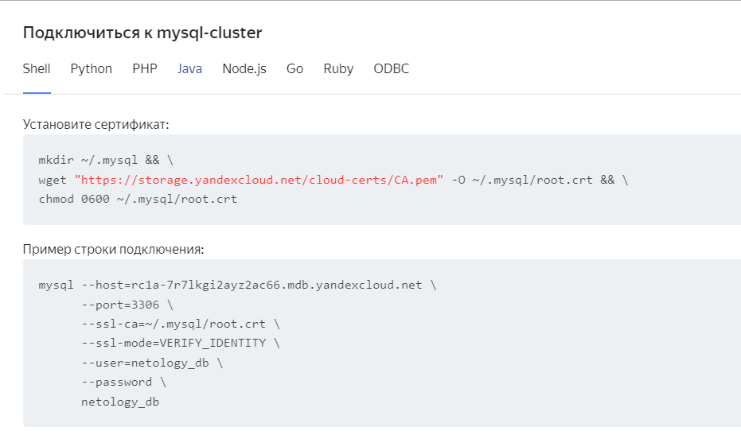
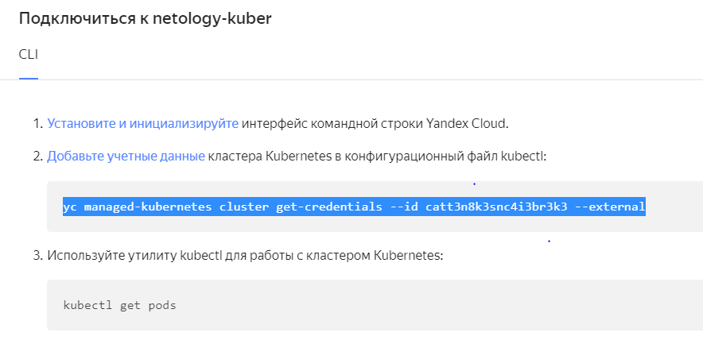
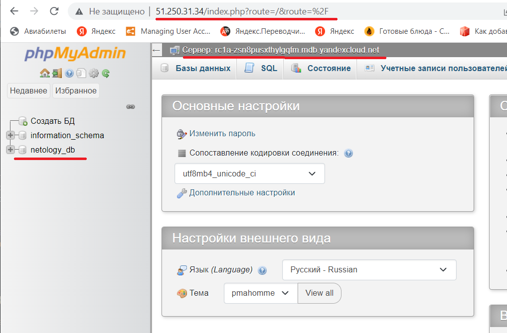

# 15.4 Кластеры. Ресурсы под управлением облачных провайдеров

Задание 1. Яндекс.Облако (обязательное к выполнению)

Развертывание решения в YandexCloud
``` 
cd terraform
terraform apply 
```

### п.1 Настроить с помощью Terraform кластер баз данных MySQL:
- Каталог со всеми файлами 
[terraform](terraform)
- Файл терраформ с кластером MySQL
[mysql.tf](terraform/mysql.tf)

#### Результат





### п.2 Настроить с помощью Terraform кластер Kubernetes

#### Результат  
Развертывание контейнера phpmyadmin и service(loadbalancer) в YandexCloud.  
Файл развертывания [phpmyadmin.tf](phpadmin/phpmyadmin.tf)  
После выполнения п.1 выполнить:
- в файле phpmyadmin/phpmyadmin.tf установить переменную с именем кластера MySQL(host).  
```
  variable "PMA_HOST" {  
    default = "rc1a-7r7lkgi2ayz2ac66.mdb.yandexcloud.net"  
     description = "MySQL HOST"  
  }
```  
  

- Настроить .kube/config, выполнив команду(c id кластера):


-  Развернуть контейнер phpmyadmin и service
``` 
cd phpmyadmin
terraform apply 
```




